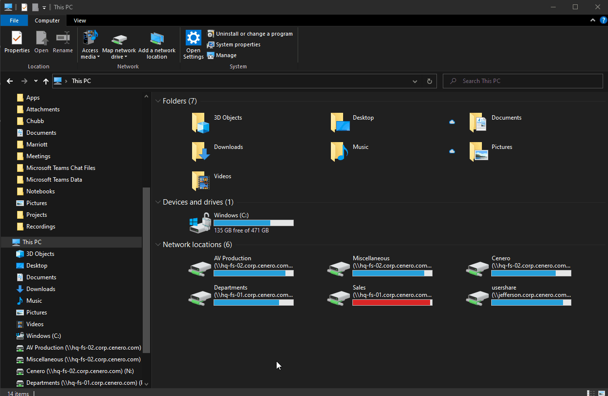
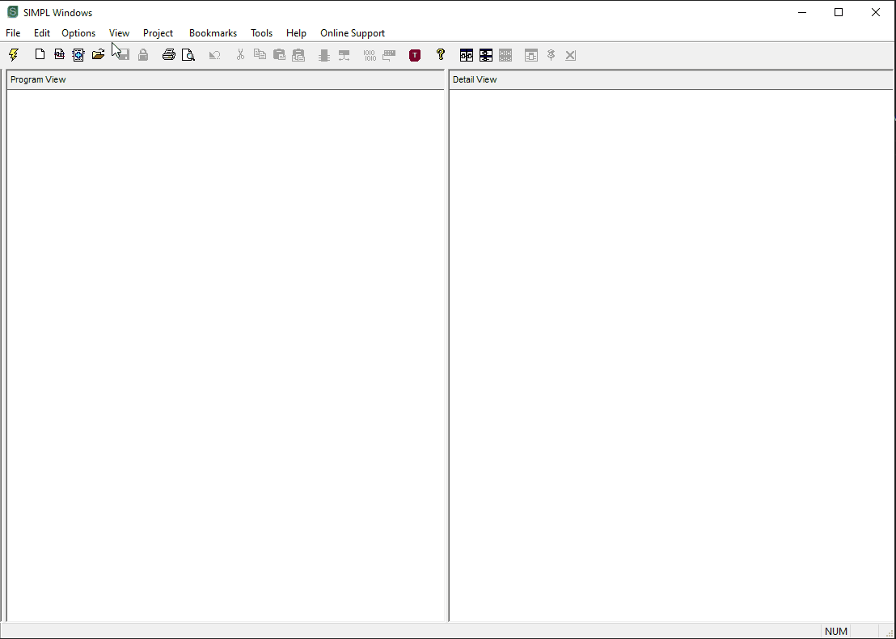
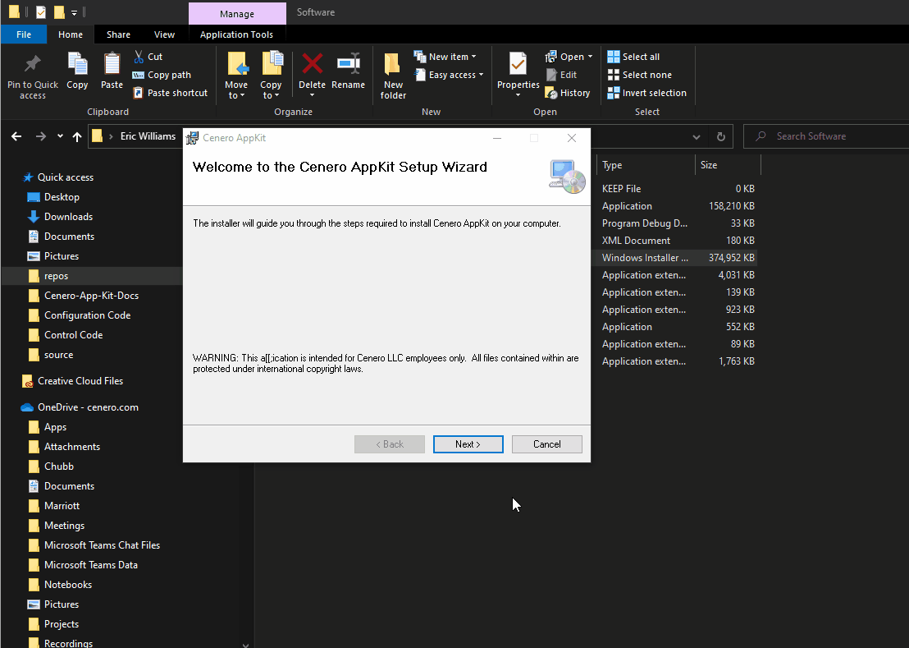
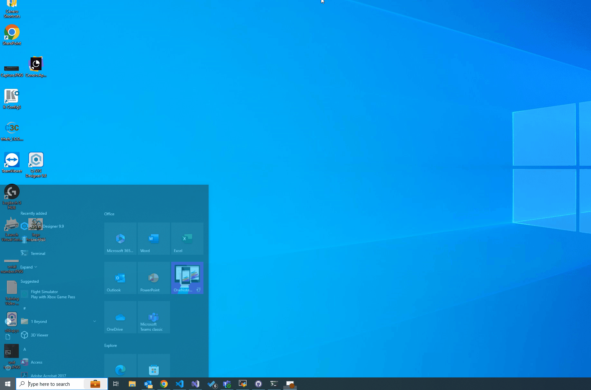

# INSTALLING CENERO APPKIT

All Cenero appkit binaries and files are distubuted through an installer located on the programming disc.  To begin installation proceed to:

 *P:\Programming\01. Appkit - SIMPL# Framework*

## 📩 Download

## 📩 Installing

During installation you will need to provide the path to your SIMPL windows user plus directories. Either copy this from SIMPL windows or ensure SIMPL is configured with the default directory displayed during installation.

Provide the installation with a matching location.  All splus and .clz files will be installed in the same directory so SIMPL windows can find the files.

## ✅ Verify Installation

Once installed you should you have a start menu shortcut the the appkit installation directory and several `.CLZ` and `.uplus` files named `Cenero.THING.THING.clz` in your splus directory.  The shotcut in the installation directory will take you to the path provided during installation.  If this path doesn't not contain the rest of your splus modules please confirm the path was correct.

## References

- Programming disc link *P:\Programming\01. Appkit - SIMPL# Framework*
- SIMPL windows *https://www.crestron.com/Products/Control-Hardware-Software/Software/Control-System-Software/SW-SIMPL*
- SIMPL Sharp *https://www.crestron.com/Products/Control-Hardware-Software/Software/Development-Software/SW-SIMPL-SHARP-PRO*