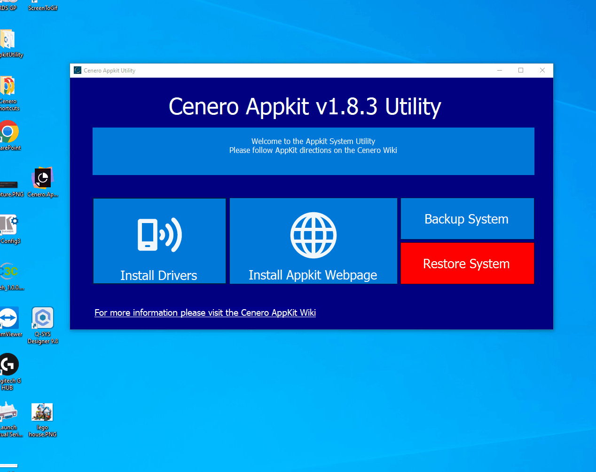
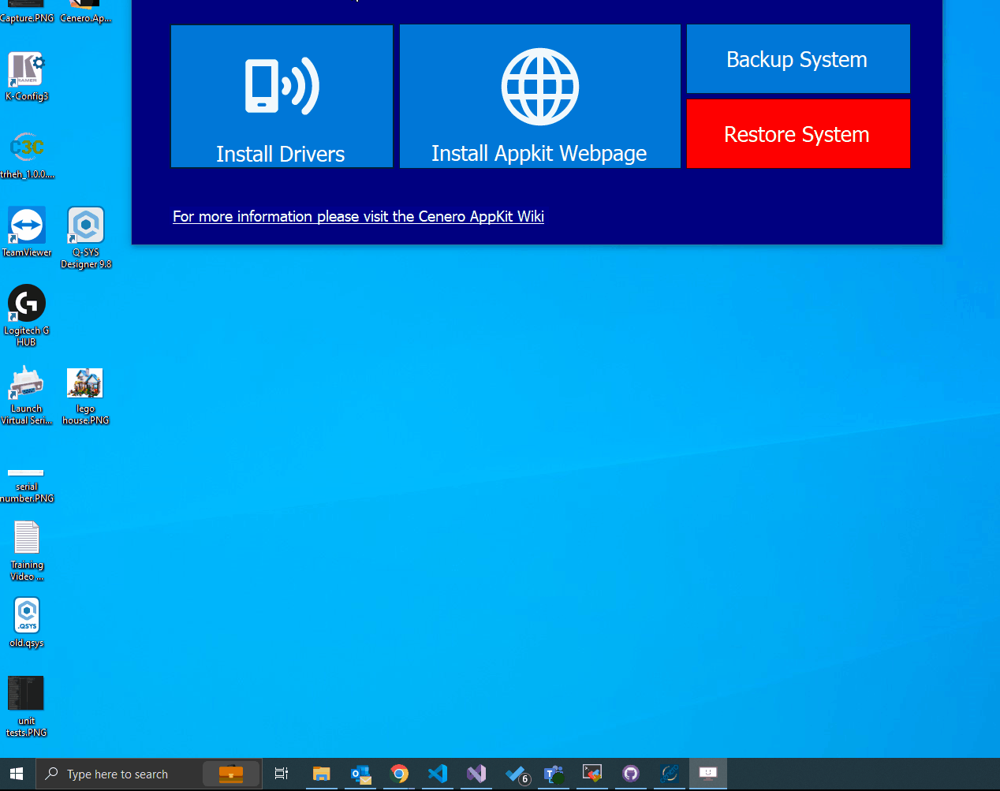
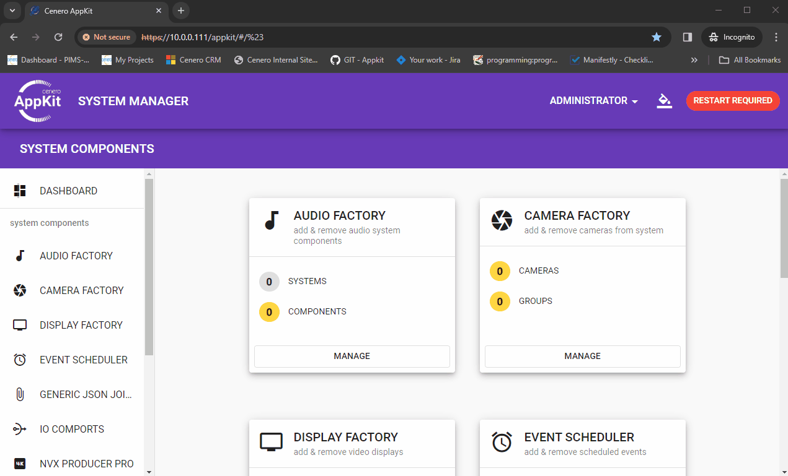
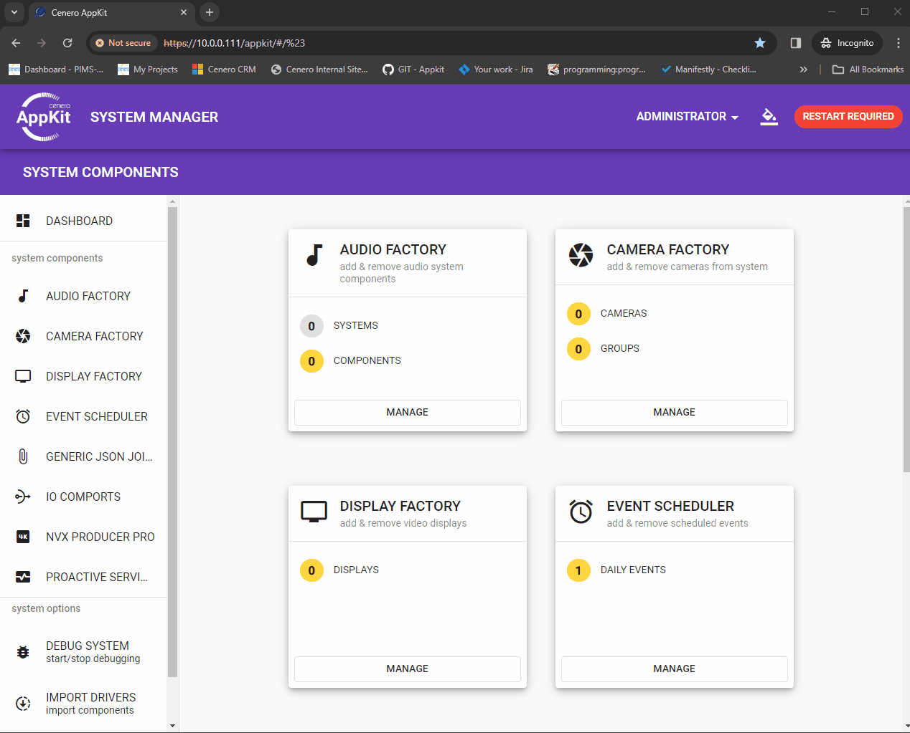

# 🕸 Driver Deployment

Launch the appkit system utility and select the `Install Drivers` option.  Fill out the system IP address and authentication settings.  **NOTE: Virtual Control Servers and C3C-Nano require no deployment as they already have the driver loaded to the /cenero/drivers directory**

## ✅ Verify Drivers

Driver are loaded to the *user/appkit* directory on the Crestron Processor.  To verify drivers have been loaded successfully use an `SFTP Client` or your choosing.  Note each apppkit subsystem will create a new child directory */user/appkit/audio*, */user/appkit/cameras* etc... **Note: on VC4 systems the user directory is relative to the room for example the user/appkit directory on a room called TEST would be located in the /opt/crestron/virtualcontro/RunningPrograms/TEST/user/appkit directory**

## 🚪 Loading Drivers

From the appkit webpage these drivers should now be accessible from the driver loading dialogs for each subsystem.

## 🧙‍♂️ Importing Drivers

The preloaded drivers on the C3C controllers can be imported from the disc to the rooms directory so they can be used by the system.  Select the 🧙‍♂️magic import divers button and select drivers to import. *Note this is ONLY displyed while running appkit applications on a VC4*.  If the restart room message is displayed a driver was replaces and the application needs to be restarted.

## 📩 References

Driver Directories

 *//USER//Appkit/*

 */user/appkit/*

 */opt/crestron/virtualcontro/RunningPrograms/ROOMID/user/appkit*

 Preloaded drivers repo */cenero/drivers/*
