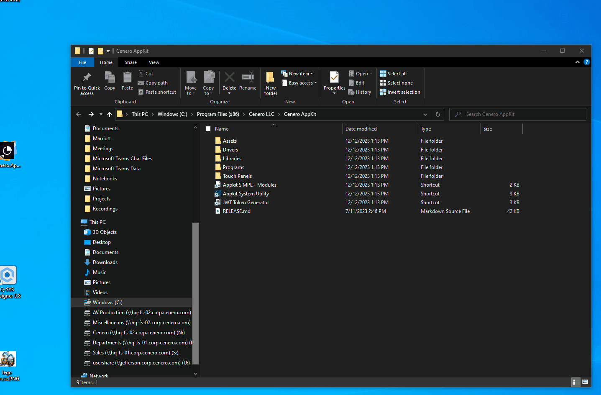

# DEPLOYMENT

To begin a new deployment navigate to the appkit installation directory.  If left default this will typically be located at *C:\Program Files (x86)\Cenero LLC\Cenero AppKit*

## Install Web Page

## Install Drivers

## Backup && Restore

