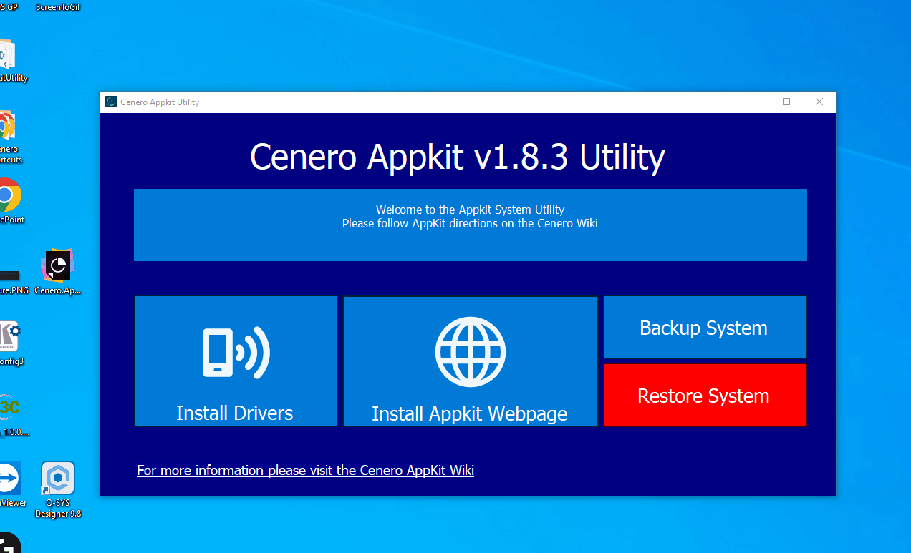

# 🕸 WEBPAGE DEPLOYMENT

Launch the appkit system utility and select the `Install Appkit Webpage` option.  When prompted enter the IP Address, username, and password for the Crestron processor.
Ensure 4-Series is checked for 4-Series appliances.  Once installed a new web browser session should open.  **NOTE: Virtual Control Servers and C3C-Nano require no deployment as they already have the appkit webpage pre-loaded to the /var/www/appkit directory**

## ✅ Verify Webpage

Sign into the webpage session using the crestron processors credentials.  Once signed into the processor you **should** be redirected.  I say should as several version of crestron firmware *didn't* properly redirect users.  If your not redirected proceed to *https://[PROCESSOR IP]/appkit/index.html*.  If no appkit application is currently running you should see the *system unreachable* dialog.  That's `OK` and the webpage has been properly deployed.

## 🚪 Access Webpage

When the webpage loads a system settings dialog will be displayed.  This dialog is required as the web page loaded in the browser session doesn't know anything about the server *i.e. Crestron Processor*.  Fill out the form to match your system's confguration.  Options are:

 typically 100% of all systems should be https as of making this document

 check this box for all VC4 systems

 typically 100% of all systems should be https as of making this document

 Check if the control system is a 3-Series processor

 Only required for 3-series

 Only required for 3-series

## 🔐 Upgrading Access to Admin

Once loaded *assuming your code is actually running (see programming tutorials for more info, just go with it)* you can now access the webpage 🎉 When the web page loads by default you will be restricted as an operator.  To actually make system changes you will need to sign into the web page as an administrator.  Use the super secrete and always annoying admin 🍌🍌🍌🍌🍌🍌🍌🍌🍌🍌🍌🍌🍌🍌🍌🍌🍌 password.  Contact your techincal team lead if you need password information.

## 📩 References

Web Page Links

 *https://ip/index.html*

 *https://ip/appkit/index.html*

 *https://ip/appkit/*
