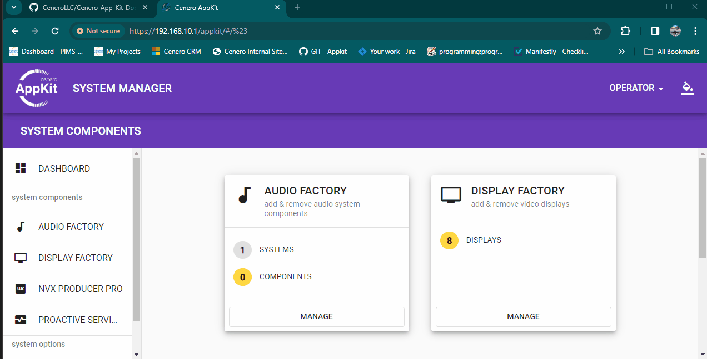

# 🎶 Audio Factory

## 🅾️ Overview

## SIMPL Windows
To begin using the audio factory ensure the `Cenero.Audio.Factory CORE` module is added to your SIMPL program or instantiated in a SIMPL# solution.
Registering the audio factory subsystem with the CORE module will ensure the audio factory option is displayed on the appkit web UI.

- Create a new folder titled *AudioFactory*
- Add the *Cenero.Audio.Factory CORE*
- Latch the *Register* signal high at program start.

*Note: adding the audio core to the system simply reogsters the subsystem and configures the system based on the current audio factory system configuration. A new empty configuration file will be created for you in the ./user/appkit/audio/ directory on your Crestron processor*

## 🎼 Audio Systems

## 🎚️ Audio Controls

## 🤩 Audio Presets 

## 🙋 Audio Controllers

## 📋 Audio Lists