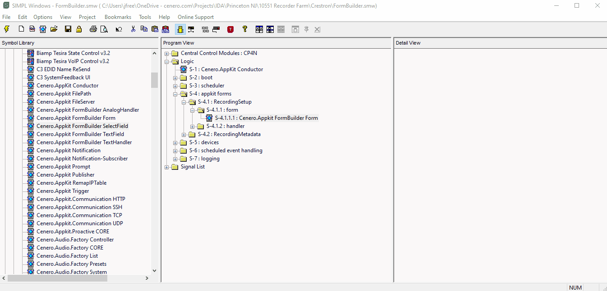

# FormBuilder

- [FormBuilder](#formbuilder)
	- [Overview](#overview)
	- [Compatibility](#compatibility)
	- [SIMPL Windows Modules](#simpl-windows-modules)
		- [Form Definition Modules](#form-definition-modules)
			- [Cenero.Appkit FormBuilder Form](#ceneroappkit-formbuilder-form)
			- [Cenero.Appkit FormBuilder SelectField](#ceneroappkit-formbuilder-selectfield)
			- [Cenero.Appkit FormBuilder TextField](#ceneroappkit-formbuilder-textfield)
		- [Form Handler Modules](#form-handler-modules)
			- [Cenero.Appkit FormBuilder TextHandler](#ceneroappkit-formbuilder-texthandler)
			- [Cenero.Appkit FormBuilder AnalogHandler](#ceneroappkit-formbuilder-analoghandler)
	- [Example Usage](#example-usage)

## Overview

FormBuilder can be used to create forms in the appkit web UI.  These forms can be used to gather structured data from the web UI and pass it into the program.  Forms can be created by adding combinations of FormBuilder modules to a program.

## Compatibility

Cenero AppKit v1.9.0 and up

## SIMPL Windows Modules

A suite of SIMPL Windows modules is provided to facilitate the creation of custom forms.  These modules are divided into two categories:

- [Form Definition Modules](#form-definition-modules)
- [Form Handler Modules](#form-handler-modules)

Each module is described in further detail below.

### Form Definition Modules

The form definition modules define the forms and their associated properties.

#### Cenero.Appkit FormBuilder Form

Defines the global properties of a form, including the form's title and tooltip.  There must be one of these modules for each form in the program.

Parameters:

- `FormId`:  A unique string that will identify this form in the program.  All of the modules used to build this form must share the same ID.
- `FormCategory`:  This parameter will be used to help categorize and filter forms on the web UI.
- `FormType`:  This parameter will be used to help categorize and filter forms on the web UI.
- `FormTitle`:  The user-friendly title of the form in the web UI.
- `FormTooltip`:  A brief description of the form for the user.
- `FormView`:  This will determine where the form will be visible on the web UI.
- `FormVisibility`:  Determines where in the event scheduler this form is available.  This parameter only applies when FormView is set to *Scheduler*.

The example below shows what this form would look like in the Event Scheduler web UI:

#### Cenero.Appkit FormBuilder SelectField

Defines a drop-down list of up to 21 statically-defined options in a form.

The list index is zero-based, and the selected item's index will be sent into the SIMPL Windows program as an analog value between 0 and 20.

Parameters

- `FormId`:  The unique ID of the form to which this property belongs.
- `PropertyName`:  The user-friendly name of the property in the web UI.
- `PropertyTooltip`:  The tooltip that will appear when the user hovers over the property on the web UI.
- `PropertyKey`:  The unique ID of this property in the form.
- `PropertyDisplayOrder`:  What order this property should appear on the form in relation to other sibling properties of the same form.
- `PropertyIsRequired`:  Whether or not the form requires this property to be filled out prior to the user submitting the form.
- `PropertyValueZero`:  The first option in the list (index 0)
- `PropertyValue[1]..[20]` - The 2nd through 21st options in the list (index 1 thru 20)

The example below shows what this SelectField would look like in the Event Scheduler web UI:

#### Cenero.Appkit FormBuilder TextField

Defines a text field in a form.

Parameters

- `FormId`:  The unique ID of the form to which this property belongs.
- `PropertyName`:  The user-friendly name of the property in the web UI.
- `PropertyTooltip`:  The tooltip that will appear when the user hovers over the property on the web UI.
- `PropertyKey`:  The unique ID of this property in the form.
- `PropertyDisplayOrder`:  What order this property should appear on the form in relation to other sibling properties of the same form.
- `PropertyIsRequired`:  Whether or not the form requires this property to be filled out prior to the user submitting the form.

The example below shows what the text field would look like in the web UI:

### Form Handler Modules

The form handler modules receive the data that was entered into the form and pass that data into SIMPL Windows

#### Cenero.Appkit FormBuilder TextHandler

Handles serial data that was entered into the form (such as the text that was typed into a TextField)

Parameters

- `FormId`:  The unique ID of the form to which this property belongs.  This parameter must match the corresponding parameter on the **Cenero.Appkit FormBuilder Form** module.
- `PropertyKey`:  The unique ID of this property in the form.  This parameter must match the corresponding parameter on the **Cenero.Appkit FormBuilder TextField** module.

Serial Outputs

- `PayloadUniqueId`:  A string containing a unique payload ID generated by the formbuilder library when the payload is sent to the handler.  Since each handler for a form receives data separately from the FormBuilder library (triggering multiple logic waves in SIMPL Windows), it can be useful to know that the outputs on the handlers are propagated with data from the same payload.  Once the payload has been received by each handler module, their payload IDs will all match, and action can be taken in the SIMPL Windows program to deal with the incoming data.  It is recommended to use an Analog Buffer and Make String Permanent in order to hold onto this data as it comes in, until all of the payload IDs match.
- `SerialPropertyData`:  The text that was entered into the form by the user.

#### Cenero.Appkit FormBuilder AnalogHandler

Handles analog values that were entered into the form (such as the selected index of a SelectField property)

Parameters

- `FormId`:  The unique ID of the form to which this property belongs.  This parameter must match the corresponding parameter on the **Cenero.Appkit FormBuilder Form** module.
- `PropertyKey`:  The unique ID of this property in the form.  This parameter must match the corresponding parameter on the **Cenero.Appkit FormBuilder TextField** module.

Serial Outputs

- `PayloadUniqueId`:  A string containing a unique payload ID generated by the formbuilder library when the payload is sent to the handler.  Since each handler for a form receives data separately from the FormBuilder library (triggering multiple logic waves in SIMPL Windows), it can be useful to know that the outputs on the handlers are propagated with data from the same payload.  Once the payload has been received by each handler module, their payload IDs will all match, and action can be taken in the SIMPL Windows program to deal with the incoming data.  It is recommended to use an Analog Buffer to hold onto this data as it comes in, until all of the payload IDs match.
- `AnalogPropertyData`:  The analog value that was entered into the form by the user, such as the index of the selected item from a SelectField property.

## Example Usage

In the following example, we will build a form that will be used with the Event Scheduler on the web UI.  Our form will capture the information required to dial a codec into a video call and record it.

We will need a form to collect the following information:

- The dial string for the meeting
- The meeting passcode
- Which layout to use on the recording hardware

First, we need to define the form.  To do this, we add the **Cenero.Appkit FormBuilder Form** module to our SIMPL program and fill out the parameters.

Since we want this form data to be handled at the start of the event (so we can dial into the meeting and start recording) we will set `FormView` to `Scheduler` and `FormVisibility` to `Start`.  This will ensure that our form is only visibile in the Start Event Actions section of the Event Scheduler.

Now that we have the "Recorder Setup" form defined, we need to define some fields/properties on that form for the user to fill out.

In our example, we'll need to know what recorder layout the user wants to use.  We'll use a SelectField for that.  Add the **Cenero.Appkit Formbuilder SelectField** to the program and fill out the parameters.  We want the recorder layout to appear as the first property in the form, so we give the `PropertyDisplayOrder` a value of 1d:

Next, we'll add properties for the meeting dial string and the passcode to our form, and set the display order of those to 2d and 3d.  The meeting may or may not require a passcode, so we'll set `PropertyIsRequired` for the passcode to `false`.

Now that our form is created, we need to handle the data that comes in when the scheduler fires our event.  We'll add a handler that corresponds to each property we already defined.  Notice that each handler has the same `FormId`, but the `PropertyKey` on each module matches the corresponding parameter on the form definition module for that same property.

Additional logic is required in SIMPL Windows; we need to make sure that we have received the entire payload before we do anything with the data that comes out of our handler modules.

In this example, a SIMPL+ module was written to compare the payload IDs and make sure they're equal before the SIMPL program responds to the event:

Once the payload IDs all match, the program then fires a Logic Wave Pulse to propagate the received data to the next set of logic symbols in the program.

Here's what the form looks like in the context of the Event Scheduler in the web UI:

