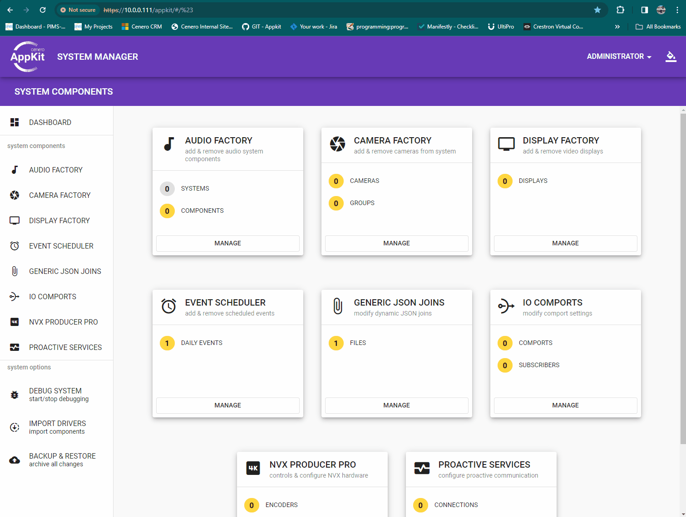

# Cenero-App-Kit-Docs

The docs, youknow those things you've been looking for!  This is public repository containing no propietary or secure information intended to provide use guides for Cenero Appkit configurations, programming, and builds or CICD
This repository includes quick user guides for configuring appkit systems, contrubiting, and installation.

Each folder in this repository includes specific guides.

## ⚙ Installing

## 👥 Contribtion

## 🎶 Conductor

## 🔉 Audio Factory

## 🎥 Camera Factory

## 📺 Display Factory

## 🕖 Event Scheduler

## 📼 NVX Producer

## 🔕 Proactive

## 🐜 Debugging